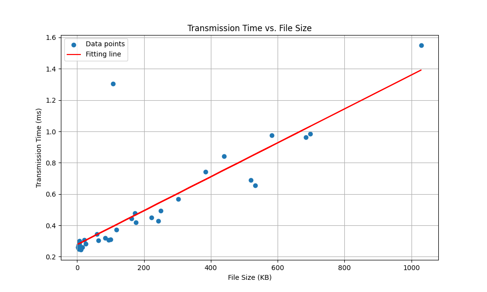

# gRPC image transmission via rust

## Execution
```bash
cd grpc_image_server
cargo run
```
    
```bash
cd grpc_image_client
cargo run
```

## Evaluation
``` bash
python3 eval.py
```
    
## Misc
* Images are retrieved from lorem picsum api, retrieval script emitted